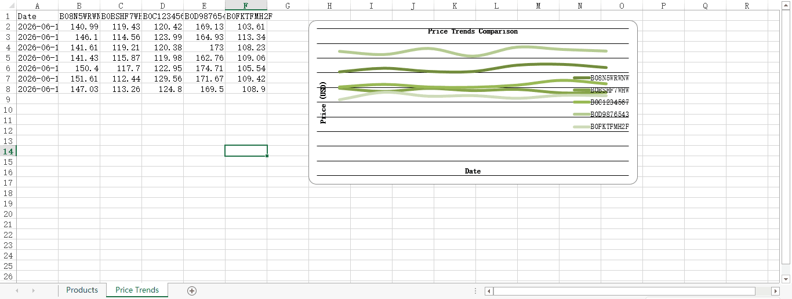

# 📊 Amazon Price Intelligence Engine

> **Real-time competitor price tracking, review analysis & automated business reports for e-commerce.**

[](https://www.python.org/downloads/)
[](https://opensource.org/licenses/MIT)
[]()
[](https://github.com/meifumarket/amazon-price-tracker/stargazers)
[](https://github.com/meifumarket/amazon-price-tracker/issues)
[](http://makeapullrequest.com)

---

## 🌟 Overview

**Amazon Price Intelligence Engine** is a production-grade web scraping toolkit for Amazon product data extraction. It provides a complete pipeline from **HTML fetching → intelligent parsing → structured CSV/Excel export → automated price trend visualization**.

Designed for e-commerce sellers, dropshippers, and data analysts who need actionable competitive intelligence without writing complex scraping code.


*Automated price trend comparison chart generated in Excel.*

---

## ✨ Key Features

| Feature | Description |
|---------|-------------|
| 🛒 **Product Extraction** | Fetch title, price, currency, rating, review count, availability by ASIN |
| 💬 **Review Mining** | Multi-page review scraping with rating, sentiment, verified-purchase detection |
| 📊 **CSV Export** | Clean, structured CSV files ready for Excel/BI tools |
| 📈 **Excel Reports** | Professional `.xlsx` output with embedded **price trend line charts** |
| 🔁 **Batch Processing** | Process hundreds of ASINs from a single input file |
| 🛡️ **Anti-Detection** | User-Agent rotation, exponential backoff, automatic retry on 429/5xx |
| 🧪 **Demo Mode** | Generate sample data without network access — perfect for testing |
| 🌐 **Multi-Currency** | Automatic detection of USD, EUR, GBP, JPY pricing |

---

## 🏗️ Architecture

```
┌─────────────────────────────────────────────────────┐
│                    CLI Interface                     │
│              (argparse subcommands)                  │
└──────────────────┬──────────────────────────────────┘
                   │
         ┌─────────▼──────────┐
         │  AmazonScraper     │  ← Orchestrator
         │  (high-level API)  │
         └───┬───────────┬────┘
             │           │
    ┌────────▼───┐ ┌─────▼──────────┐
    │ SafeHTTP   │ │ AmazonParser   │
    │ Client     │ │ (BS4 + lxml)   │
    │ · UA rot.  │ │ · Products     │
    │ · Retries  │ │ · Reviews      │
    │ · Backoff  │ │ · Multi-curr.  │
    └────────────┘ └──────┬─────────┘
                         │
              ┌──────────▼──────────┐
              │    Exporter Module   │
              │ · CSV writer         │
              │ · Excel + Charts    │
              └─────────────────────┘
```

### Module Breakdown

| Module | File | Purpose |
|--------|------|---------|
| HTTP Client | `src/http_client.py` | Rate-limited, retry-aware session with UA rotation |
| Parser | `src/parser.py` | BeautifulSoup + lxml selectors for product/review DOM |
| Scraper | `src/scraper.py` | High-level API combining client + parser |
| CLI | `src/cli.py` | Subcommand interface (`product`, `batch`, `demo`) |
| Exporter | `src/exporter.py` | CSV/Excel export with embedded `openpyxl` charts |

---

## 🚀 Quick Start

### 1. Installation

```bash
git clone https://github.com/meifumarket/amazon-price-tracker.git
cd amazon-price-tracker
python -m venv venv
source venv/bin/activate          # Linux/macOS
# venv\Scripts\activate           # Windows

pip install -r requirements.txt
```

### 2. Usage

```bash
# Demo mode — generates sample data (no network needed)
python -m src.cli demo

# Extract a single product by ASIN
python -m src.cli product B08N5WRWNW

# Extract product + reviews (3 pages)
python -m src.cli product B08N5WRWNW --reviews --pages 3

# Batch process ASINs from a file
python -m src.cli batch asins.txt
```

### 3. Output

```
output/
├── B08N5WRWNW_product.csv       # Product data
├── B08N5WRWNW_reviews.csv       # Reviews data
├── competitive_analysis_demo.xlsx  # Excel with embedded charts
└── demo_product.csv             # Demo sample
```

Open `competitive_analysis_demo.xlsx` → **Price Trends** tab to see the auto-generated line chart.

---

## 📋 Requirements

| Package | Version | Purpose |
|---------|---------|---------|
| `requests` | >= 2.31.0 | HTTP client with session management |
| `beautifulsoup4` | >= 4.12.0 | HTML parsing |
| `lxml` | >= 4.9.0 | Fast XML/HTML parser backend |
| `pandas` | >= 2.0.0 | Data manipulation & pivot tables |
| `openpyxl` | >= 3.1.0 | Excel export with chart rendering |
| `urllib3` | >= 2.0.0 | Retry & connection pooling |
| `playwright` | >= 1.40.0 | Optional: JS-rendered page scraping |

---

## 🎯 Use Cases

- **Dropshipping**: Monitor supplier price changes across Amazon listings
- **Competitive Analysis**: Track pricing strategies of top 10 competitors
- **Review Intelligence**: Analyze customer sentiment at scale
- **Deal Hunting**: Detect price drops for products on your watchlist
- **Market Research**: Build competitive matrices for investor pitches

---

## ⚠️ Compliance Notice

This tool is intended for **educational and research purposes**. Please:

- Respect Amazon's `robots.txt` and Terms of Service
- Implement appropriate rate limiting in production use
- Consider using [Amazon Product Advertising API](https://affiliate-program.amazon.com/associate-help) for commercial applications
- Be aware of legal implications of web scraping in your jurisdiction

---

## 📄 License

[MIT License](LICENSE) — Free to use, modify, and distribute.

---

## 💼 Need Custom Automation?

I build custom e-commerce automation systems for businesses.

- **Fiverr**: [fiverr.com/meifumarket](https://www.fiverr.com/meifumarket)
- **GitHub**: [@meifumarket](https://github.com/meifumarket)
- **Email**: 858679@qq.com

---

## 🙏 Acknowledgments

Built with [BeautifulSoup](https://www.crummy.com/software/BeautifulSoup/), [pandas](https://pandas.pydata.org/), and [openpyxl](https://openpyxl.readthedocs.io/).
